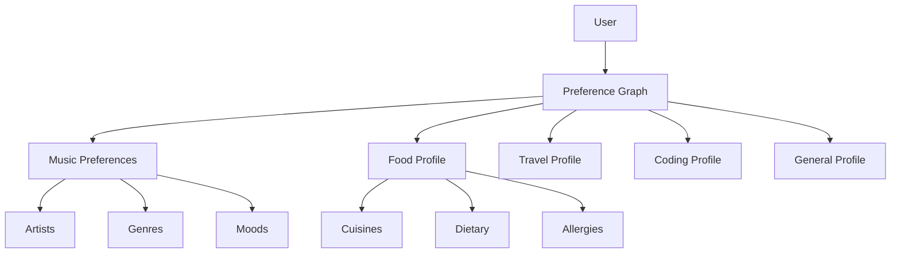
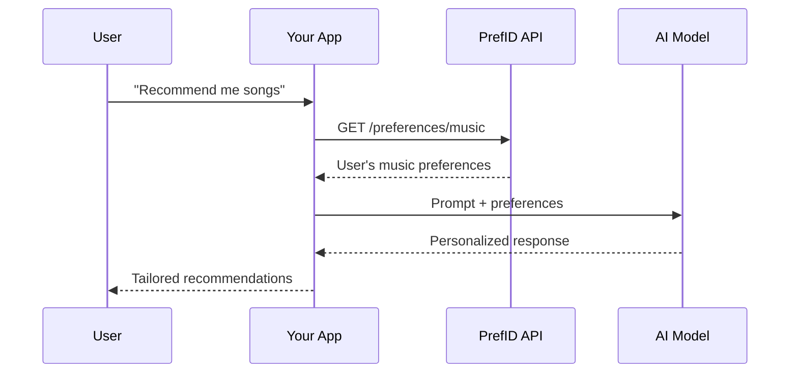

## Preference Graph

At the heart of PrefID is the **Preference Graph** — a structured representation of user preferences across multiple domains.



## Domains

Preferences are organized into **domains** — logical groupings that represent different aspects of user identity.

<AccordionGroup>
  <Accordion title="music_preferences" icon="music">
    Musical tastes, favorite artists, genres, streaming habits, and mood-based listening patterns.
    
    **Signals**: Spotify listening history, explicit preferences, concert attendance
  </Accordion>
  
  <Accordion title="food_profile" icon="utensils">
    Dietary restrictions, favorite cuisines, allergies, cooking preferences, and restaurant favorites.
    
    **Signals**: Order history, explicit preferences, restaurant reviews
  </Accordion>
  
  <Accordion title="travel_profile" icon="plane">
    Travel style, preferred airlines/hotels, destination preferences, and booking patterns.
    
    **Signals**: Booking history, travel reviews, explicit preferences
  </Accordion>
  
  <Accordion title="coding_profile" icon="code">
    Programming languages, frameworks, editor preferences, and coding style.
    
    **Signals**: GitHub activity, explicit preferences, project analysis
  </Accordion>
  
  <Accordion title="finance_profile" icon="wallet">
    Investment style, risk tolerance, and financial preferences.
    
    **Signals**: Explicit preferences, risk assessments
  </Accordion>
  
  <Accordion title="general_profile" icon="user">
    Name, communication style, interests, and general preferences.
    
    **Signals**: User-provided information, behavioral analysis
  </Accordion>
</AccordionGroup>

## Atoms

**Atoms** are the smallest unit of preference data. Each atom represents a single preference signal.

```json
{
  "atom_id": "atom_abc123",
  "domain": "music_preferences",
  "key": "favorite_artist",
  "value": "AR Rahman",
  "confidence": 0.95,
  "source": "spotify_history",
  "created_at": "2024-12-19T10:00:00Z"
}
```

### Atom Properties

| Property | Description |
|----------|-------------|
| `atom_id` | Unique identifier for the atom |
| `domain` | The domain this atom belongs to |
| `key` | The preference key (e.g., "favorite_artist") |
| `value` | The preference value |
| `confidence` | Confidence score (0.0 - 1.0) |
| `source` | Where this preference was learned from |

## Agent Hints

**Agent Hints** are structured prompts generated from the preference graph, designed to be injected into AI context.

```json
{
  "hints": [
    "User loves AR Rahman and Indian classical music",
    "Prefers vegetarian food, allergic to peanuts",
    "Likes window seats on flights"
  ],
  "domains_used": ["music_preferences", "food_profile", "travel_profile"],
  "token_count": 45
}
```

<Tip>
  Use agent hints instead of raw preferences for better AI context injection. They're optimized for token efficiency.
</Tip>

## Scopes

OAuth scopes control what data applications can access:

| Scope | Access |
|-------|--------|
| `preferences:read` | Read all preferences |
| `preferences:write` | Write preferences |
| `music_preferences` | Read music domain only |
| `food_profile` | Read food domain only |
| `travel_profile` | Read travel domain only |
| `coding_profile` | Read coding domain only |
| `agent_hints` | Access agent hints endpoint |

## Semantic Firewall™

The **Semantic Firewall** protects user preferences from unauthorized access and ensures data quality:

<Steps>
  <Step title="Input Validation">
    All preference updates are validated against domain schemas
  </Step>
  <Step title="Scope Enforcement">
    Applications can only access scopes the user granted
  </Step>
  <Step title="Audit Logging">
    All access is logged for user transparency
  </Step>
  <Step title="User Corrections">
    Users can suppress incorrect preferences via "This Doesn't Fit Me"
  </Step>
</Steps>

## Architecture Overview


