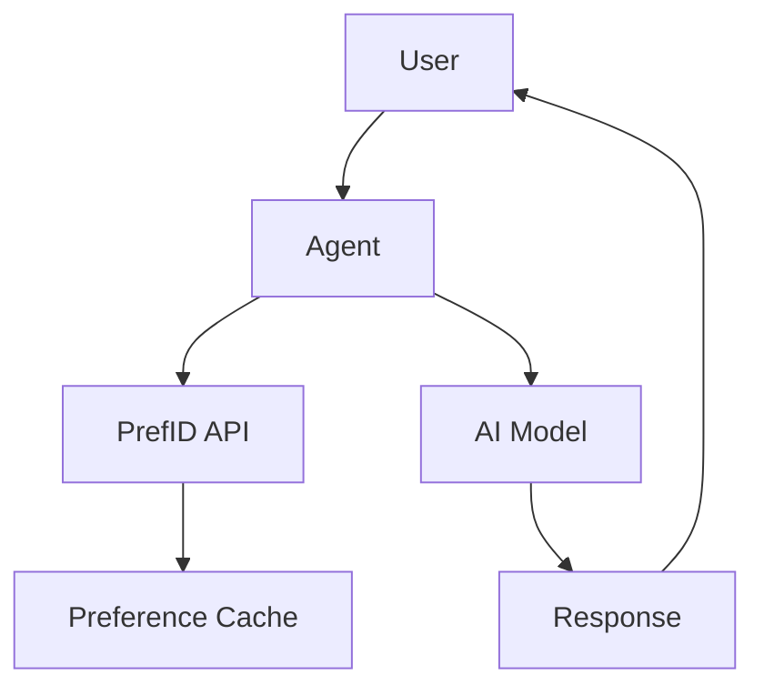

## Overview

This guide shows how to build custom AI agents that leverage PrefID for persistent user context.

## Architecture



## Basic Agent Structure

```typescript
import { PrefID } from '@prefid/sdk';
import { OpenAI } from 'openai';

interface AgentConfig {
  name: string;
  domains: string[];
  systemPrompt: string;
}

class PersonalizedAgent {
  private prefid: PrefID;
  private openai: OpenAI;
  private config: AgentConfig;
  private preferencesCache: Map<string, any> = new Map();
  
  constructor(config: AgentConfig) {
    this.config = config;
    this.prefid = new PrefID({ /* config */ });
    this.openai = new OpenAI();
  }
  
  async initializeForUser(accessToken: string) {
    // Pre-fetch and cache preferences
    const hints = await this.prefid.getAgentHints({
      accessToken,
      domains: this.config.domains,
      maxTokens: 150
    });
    
    this.preferencesCache.set(accessToken, hints.data);
    return this;
  }
  
  async chat(message: string, accessToken: string) {
    const cached = this.preferencesCache.get(accessToken);
    
    const response = await this.openai.chat.completions.create({
      model: 'gpt-4',
      messages: [
        {
          role: 'system',
          content: `${this.config.systemPrompt}

User Context:
${cached?.hints.join('\n') || 'No preferences available'}`
        },
        { role: 'user', content: message }
      ]
    });
    
    return response.choices[0].message.content;
  }
}

// Usage
const musicAgent = new PersonalizedAgent({
  name: 'MusicBot',
  domains: ['music_preferences'],
  systemPrompt: 'You are a music recommendation expert.'
});

await musicAgent.initializeForUser(accessToken);
const response = await musicAgent.chat('Suggest a playlist for focus', accessToken);
```

## Multi-Domain Agent

```typescript
class UniversalAssistant {
  private agents: Map<string, PersonalizedAgent> = new Map();
  
  constructor() {
    // Create specialized sub-agents
    this.agents.set('music', new PersonalizedAgent({
      name: 'MusicExpert',
      domains: ['music_preferences'],
      systemPrompt: 'You are a music expert.'
    }));
    
    this.agents.set('travel', new PersonalizedAgent({
      name: 'TravelPlanner',
      domains: ['travel_profile'],
      systemPrompt: 'You are a travel planning expert.'
    }));
    
    this.agents.set('food', new PersonalizedAgent({
      name: 'FoodAdvisor',
      domains: ['food_profile'],
      systemPrompt: 'You are a culinary expert.'
    }));
  }
  
  async route(message: string, accessToken: string) {
    // Classify intent
    const intent = await this.classifyIntent(message);
    
    // Route to appropriate agent
    const agent = this.agents.get(intent) || this.agents.get('general');
    
    if (agent) {
      await agent.initializeForUser(accessToken);
      return agent.chat(message, accessToken);
    }
    
    return 'I can help with music, travel, and food recommendations!';
  }
  
  private async classifyIntent(message: string): Promise<string> {
    // Simple keyword-based routing (could use AI for better classification)
    const lower = message.toLowerCase();
    if (lower.includes('music') || lower.includes('song') || lower.includes('playlist')) {
      return 'music';
    }
    if (lower.includes('travel') || lower.includes('trip') || lower.includes('flight')) {
      return 'travel';
    }
    if (lower.includes('food') || lower.includes('restaurant') || lower.includes('eat')) {
      return 'food';
    }
    return 'general';
  }
}
```

## Reactive Agent with Preference Updates

```typescript
class ReactiveAgent {
  private prefid: PrefID;
  private webSocket: WebSocket;
  
  constructor() {
    this.prefid = new PrefID({ /* config */ });
    
    // Listen for preference updates
    this.webSocket = new WebSocket('wss://api.prefid.dev/v1/preferences/stream');
    this.webSocket.onmessage = this.handlePreferenceUpdate.bind(this);
  }
  
  private handlePreferenceUpdate(event: MessageEvent) {
    const update = JSON.parse(event.data);
    
    if (update.type === 'preference_changed') {
      // Clear cache for this user
      this.preferencesCache.delete(update.user_id);
      
      // Optionally notify the user
      console.log(`Preferences updated for domain: ${update.domain}`);
    }
  }
  
  async getLatestContext(accessToken: string) {
    // Always get fresh preferences
    return this.prefid.getAgentHints({
      accessToken,
      maxTokens: 100
    });
  }
}
```

## Agent with Memory and Preferences

```typescript
interface ConversationTurn {
  role: 'user' | 'assistant';
  content: string;
  timestamp: Date;
}

class MemoryAgent {
  private memory: Map<string, ConversationTurn[]> = new Map();
  private preferences: Map<string, any> = new Map();
  private prefid: PrefID;
  
  async chat(
    userId: string,
    message: string,
    accessToken: string
  ): Promise<string> {
    // Get or initialize memory
    const history = this.memory.get(userId) || [];
    
    // Get or fetch preferences
    let prefs = this.preferences.get(userId);
    if (!prefs) {
      prefs = await this.prefid.getAgentHints({ accessToken });
      this.preferences.set(userId, prefs);
    }
    
    // Build messages with history and preferences
    const messages = [
      {
        role: 'system',
        content: `User context: ${prefs.data.hints.join('. ')}`
      },
      ...history.slice(-10).map(t => ({
        role: t.role,
        content: t.content
      })),
      { role: 'user', content: message }
    ];
    
    const response = await this.openai.chat.completions.create({
      model: 'gpt-4',
      messages
    });
    
    const reply = response.choices[0].message.content;
    
    // Update memory
    history.push(
      { role: 'user', content: message, timestamp: new Date() },
      { role: 'assistant', content: reply, timestamp: new Date() }
    );
    this.memory.set(userId, history);
    
    return reply;
  }
}
```

## Best Practices

<CardGroup cols={2}>
  <Card title="Cache Preferences" icon="database">
    Cache preferences per session to reduce latency
  </Card>
  <Card title="Handle Missing Data" icon="shield">
    Gracefully handle users without preferences
  </Card>
  <Card title="Refresh Periodically" icon="refresh">
    Refresh preferences for long-running sessions
  </Card>
  <Card title="Minimal Domains" icon="minimize">
    Only fetch domains your agent actually uses
  </Card>
</CardGroup>

<Warning>
  Always handle the case where a user hasn't connected PrefID yet. Provide a graceful fallback experience.
</Warning>
