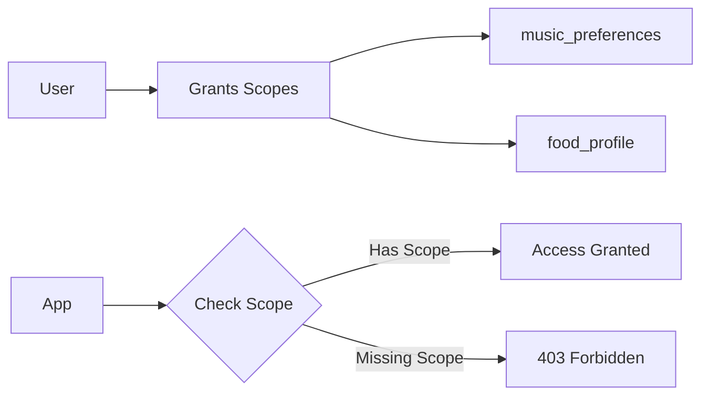

## Overview

PrefID is built with security and privacy at its core. This guide covers our security practices and how to implement secure integrations.

## Data Ownership

<Note>
**Your data belongs to you.** PrefID acts as a secure vault for user preferences, not an owner.
</Note>

- Users have full control over their data
- Users can view, export, and delete their data at any time
- Users control which apps can access their preferences
- All access is audited and visible to users

## Authentication Security

### OAuth 2.0 + PKCE

We require **PKCE (Proof Key for Code Exchange)** for all OAuth flows:

```typescript
// Always use PKCE
const codeVerifier = generateCodeVerifier();
const codeChallenge = generateCodeChallenge(codeVerifier);

// Include in authorization request
authUrl.searchParams.set('code_challenge', codeChallenge);
authUrl.searchParams.set('code_challenge_method', 'S256');
```

### Token Security

| Token Type | Lifetime | Usage |
|-----------|----------|-------|
| Access Token | 1 hour | API requests |
| Refresh Token | 30 days | Get new access tokens |
| Authorization Code | 10 minutes | Exchange for tokens |

<Warning>
Never expose tokens in client-side code. Always exchange tokens server-side.
</Warning>

## Scope-Based Access Control

Applications can only access data the user explicitly grants:



### Best Practices

<CardGroup cols={2}>
  <Card title="Request Minimal Scopes" icon="minimize">
    Only request the scopes you actually need
  </Card>
  <Card title="Explain Scope Usage" icon="message">
    Tell users why you need each scope
  </Card>
</CardGroup>

## API Security

### HTTPS Only

All API requests must use HTTPS. HTTP requests are rejected.

### Rate Limiting

| Plan | Limit | Burst |
|------|-------|-------|
| Free | 100/min | 20 |
| Pro | 1,000/min | 100 |
| Enterprise | Custom | Custom |

### Request Signing (Optional)

For additional security, you can sign requests:

```typescript
const signature = crypto
  .createHmac('sha256', clientSecret)
  .update(requestBody)
  .digest('hex');

headers['X-Prefid-Signature'] = signature;
```

## Data Protection

### Encryption

- **At Rest**: AES-256 encryption
- **In Transit**: TLS 1.3
- **Tokens**: Encrypted before storage

### Data Residency

PrefID currently stores data in:
- **Primary**: US-East (AWS)
- **Enterprise**: Custom regions available

## Semantic Firewall™

The Semantic Firewall protects preference integrity:

<Steps>
  <Step title="Input Validation">
    All preference updates are validated against domain schemas
  </Step>
  <Step title="Anomaly Detection">
    Unusual patterns trigger verification
  </Step>
  <Step title="User Corrections">
    Users can suppress incorrect preferences
  </Step>
  <Step title="Audit Trail">
    All changes are logged for transparency
  </Step>
</Steps>

## Audit Logging

Every access is logged and visible to users:

```json
{
  "event": "preference_read",
  "app_name": "MusicBot",
  "domain": "music_preferences",
  "timestamp": "2024-12-19T10:30:00Z",
  "ip": "xxx.xxx.xxx.xxx"
}
```

Users can view their audit log in the PrefID dashboard.

## Incident Response

If you discover a security vulnerability:

1. **Email**: security@prefid.dev
2. **Do not** disclose publicly until patched
3. We aim to respond within 24 hours
4. Responsible disclosure rewards available

## Compliance

- **GDPR**: Full compliance with data export/deletion
- **CCPA**: California privacy rights supported
- **SOC 2**: In progress
