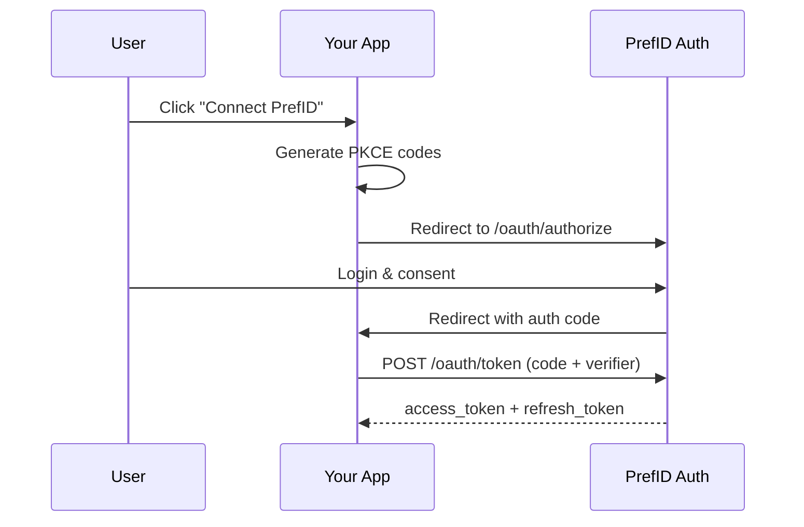

## Overview

PrefID uses **OAuth 2.0 with PKCE** (Proof Key for Code Exchange) for secure authentication. This ensures that user preferences are only accessible with explicit user consent.

## OAuth Flow



## Step 1: Register Your Application

Create an OAuth application in the [Developer Portal](https://pref-id.vercel.app/developer):

1. Go to **Developer Portal** → **Create OAuth Application**
2. Enter your app details:
   - **App Name**: Display name shown to users
   - **Redirect URI**: Where to redirect after authorization
   - **Scopes**: Permissions your app needs
3. Save your `client_id` and `client_secret`

<Warning>
  Your `client_secret` is only shown once. Store it securely!
</Warning>

## Step 2: Generate PKCE Codes

```typescript
import crypto from 'crypto';

function generateCodeVerifier() {
  return crypto.randomBytes(32).toString('base64url');
}

function generateCodeChallenge(verifier: string) {
  return crypto
    .createHash('sha256')
    .update(verifier)
    .digest('base64url');
}

const codeVerifier = generateCodeVerifier();
const codeChallenge = generateCodeChallenge(codeVerifier);

// Store codeVerifier in session for later use
```

## Step 3: Redirect to Authorization

Build the authorization URL and redirect the user:

```typescript
const authUrl = new URL('https://pref-id.vercel.app/oauth/authorize');
authUrl.searchParams.set('client_id', process.env.PREFID_CLIENT_ID);
authUrl.searchParams.set('redirect_uri', 'https://yourapp.com/callback');
authUrl.searchParams.set('response_type', 'code');
authUrl.searchParams.set('scope', 'preferences:read music_preferences');
authUrl.searchParams.set('state', 'random-state-for-csrf');
authUrl.searchParams.set('code_challenge', codeChallenge);
authUrl.searchParams.set('code_challenge_method', 'S256');

// Redirect user
res.redirect(authUrl.toString());
```

### Authorization Parameters

| Parameter | Required | Description |
|-----------|----------|-------------|
| `client_id` | Yes | Your application's client ID |
| `redirect_uri` | Yes | Where to redirect after auth |
| `response_type` | Yes | Must be `code` |
| `scope` | Yes | Space-separated list of scopes |
| `state` | Recommended | CSRF protection token |
| `code_challenge` | Yes | PKCE code challenge |
| `code_challenge_method` | Yes | Must be `S256` |

## Step 4: Handle Callback

After user authorizes, they're redirected to your callback URL:

```typescript
// GET /callback?code=xxx&state=xxx
app.get('/callback', async (req, res) => {
  const { code, state } = req.query;
  
  // Verify state matches what you sent
  if (state !== storedState) {
    return res.status(400).send('Invalid state');
  }
  
  // Exchange code for tokens
  const tokens = await exchangeCode(code);
  
  // Store tokens securely
  req.session.tokens = tokens;
  
  res.redirect('/dashboard');
});
```

## Step 5: Exchange Code for Tokens

```typescript
async function exchangeCode(code: string) {
  const response = await fetch('https://api.prefid.dev/oauth/token', {
    method: 'POST',
    headers: {
      'Content-Type': 'application/x-www-form-urlencoded',
    },
    body: new URLSearchParams({
      grant_type: 'authorization_code',
      client_id: process.env.PREFID_CLIENT_ID,
      client_secret: process.env.PREFID_CLIENT_SECRET,
      code: code,
      redirect_uri: 'https://yourapp.com/callback',
      code_verifier: storedCodeVerifier,
    }),
  });
  
  return response.json();
}
```

### Token Response

```json
{
  "access_token": "prefid_at_xxxxx",
  "refresh_token": "prefid_rt_xxxxx",
  "token_type": "Bearer",
  "expires_in": 3600,
  "scope": "preferences:read music_preferences"
}
```

## Step 6: Use Access Token

```typescript
const response = await fetch('https://api.prefid.dev/v1/preferences/music_preferences', {
  headers: {
    'Authorization': `Bearer ${accessToken}`,
  },
});

const preferences = await response.json();
```

## Refreshing Tokens

Access tokens expire after 1 hour. Use the refresh token to get new ones:

```typescript
async function refreshAccessToken(refreshToken: string) {
  const response = await fetch('https://api.prefid.dev/oauth/token', {
    method: 'POST',
    headers: {
      'Content-Type': 'application/x-www-form-urlencoded',
    },
    body: new URLSearchParams({
      grant_type: 'refresh_token',
      client_id: process.env.PREFID_CLIENT_ID,
      client_secret: process.env.PREFID_CLIENT_SECRET,
      refresh_token: refreshToken,
    }),
  });
  
  return response.json();
}
```

## Available Scopes

| Scope | Description |
|-------|-------------|
| `preferences:read` | Read all user preferences |
| `preferences:write` | Write/update preferences |
| `music_preferences` | Access music domain only |
| `food_profile` | Access food domain only |
| `travel_profile` | Access travel domain only |
| `coding_profile` | Access coding domain only |
| `agent_hints` | Access agent hints |
| `profile:read` | Read user profile info |

## Security Best Practices

<CardGroup cols={2}>
  <Card title="Always Use PKCE" icon="shield">
    PKCE prevents authorization code interception attacks
  </Card>
  <Card title="Validate State" icon="check">
    Always verify the state parameter to prevent CSRF
  </Card>
  <Card title="Secure Token Storage" icon="lock">
    Store tokens server-side or in encrypted storage
  </Card>
  <Card title="Request Minimal Scopes" icon="minimize">
    Only request the scopes you actually need
  </Card>
</CardGroup>
